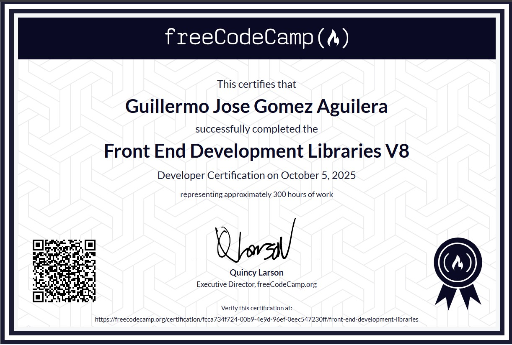
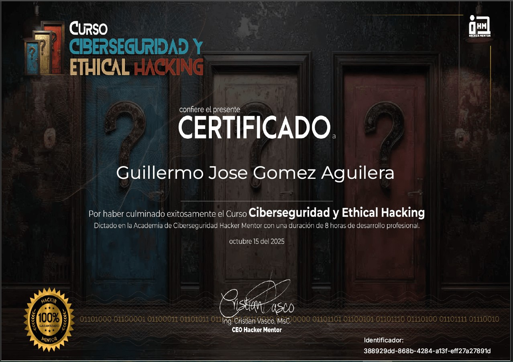

<div align="center">

<!-- Hero animado mejorado -->


# 👋 Hola, soy Guillermo Gomez Aguilera

### 💻 Desarrollador Junior | 🎨 Creador de Experiencias Digitales | 🚀 Apasionado por la Tecnología

<p align="center">
  
</p>

[](mailto:gomezguille391@gmail.com)
[](https://github.com/GuillermoGome2z)
[](https://maps.google.com/?q=Guazacapan,Santa+Rosa,Guatemala)


</div>

---

## 🚀 Sobre Mí

```javascript
const guillermo = {
    location: "Guazacapan, Santa Rosa 🇬🇹",
    email: "gomezguille391@gmail.com",
    githubUsername: "GuillermoGome2z",
    publicRepos: 13,
    currentFocus: "Desarrollo Junior & Experiencias de Usuario",
    technologies: {
        frontEnd: ["React", "Vue", "JavaScript", "TypeScript", "HTML5", "CSS3"],
        backEnd: ["Node.js", "Express", "Python"],
        databases: ["MongoDB", "PostgreSQL", "MySQL"],
        tools: ["Git", "Docker", "VS Code", "Figma", "Postman"],
        cloud: ["Vercel", "Netlify"]
    },
    learning: ["Next.js", "GraphQL", "Kubernetes", "Three.js"],
    interests: ["Web Performance", "UI/UX", "Open Source", "AI/ML"],
    funFact: "Me encanta resolver problemas complejos con código simple",
    motto: "El código limpio es el arte de la simplicidad ✨"
};
```

<div align="center">

## 📊 Estadísticas de GitHub


</div>

---

## 🛠️ Stack Tecnológico

<div align="center">

### 🎨 Frontend


### ⚙️ Backend


### 🗄️ Databases & Cloud


### 🔧 Tools & Others


</div>

---

---

## 🎓 Certificaciones Profesionales

<div align="center">


<br><br>

### 🏆 Mis Certificados Verificados

<table>
  <tr>
    <td align="center" width="50%">
      <a href="https://freecodecamp.org/certification/fcca734f724-00b9-4e9d-96ef-0eec547230ff/front-end-development-libraries" target="_blank">
        
      </a>
      <br><br>
      
      <br><br>
      <strong style="font-size: 18px;">Front End Development Libraries V8</strong>
      <br>
      <sub>freeCodeCamp.org</sub>
      <br>
      <sub>📅 Octubre 2025 • ⏱️ 300 horas</sub>
      <br>
      <sub>✅ React, Redux, jQuery, Bootstrap, SASS</sub>
      <br><br>
      <a href="https://freecodecamp.org/certification/fcca734f724-00b9-4e9d-96ef-0eec547230ff/front-end-development-libraries" target="_blank">
        
      </a>
    </td>
    <td align="center" width="50%">
      
      <br><br>
      
      <br><br>
      <strong style="font-size: 18px;">Ciberseguridad y Ethical Hacking</strong>
      <br>
      <sub>Academia Hacker Mentor</sub>
      <br>
      <sub>📅 Octubre 2025 • ⏱️ 8 horas</sub>
      <br>
      <sub>✅ Ethical Hacking, Penetration Testing, Security</sub>
      <br><br>
      
    </td>
  </tr>
</table>

<br>

> 🎯 **Certificaciones verificables** - Click en "Verificar Certificado" para validar autenticidad

</div>

---

## 🌟 Proyectos Destacados

<div align="center">

### 🔥 Repositorios más populares

[](https://github.com/GuillermoGome2z/GuillermoGomez2z)

</div>


### 💼 Proyectos en los que he trabajado:

- 🚀 **E-commerce Full Stack** - Tienda online con React, Node.js y MongoDB
- 🎨 **Portfolio Interactivo** - Sitio personal con animaciones Three.js
- 📱 **App Móvil** - Aplicación híbrida con React Native
- 🤖 **Chatbot IA** - Asistente virtual con procesamiento de lenguaje natural
- 📊 **Dashboard Analytics** - Panel de control con visualización de datos

---

## 📈 Actividad de Contribución

<div align="center">


</div>

---

## 🏆 Logros de GitHub

<div align="center">


</div>

---

---

## 💡 Frase Motivacional del Día

<div align="center">

<table>
<tr>
<td align="center" style="padding: 20px;">


<br><br>

<sub>📚 Última actualización: 2025-11-10 16:58:24 UTC 📚</sub>

<br>

<sub>💫 Esta frase cambia automáticamente cada 6 horas 💫</sub>

</td>
</tr>
</table>

</div>

---


## 📚 Últimas Publicaciones del Blog

<!-- BLOG-POST-LIST:START -->
- 🚀 Cómo optimizar el rendimiento de React en 2025
- 🎨 Guía completa de animaciones CSS modernas
- 🔧 Docker para desarrolladores: De cero a héroe
- 💻 Las mejores prácticas de TypeScript
<!-- BLOG-POST-LIST:END -->

---

## 📫 Conecta Conmigo

<div align="center">

### ¿Tienes un proyecto en mente? ¿Quieres colaborar? ¡Hablemos!

[](mailto:gomezguille391@gmail.com)
[](https://linkedin.com/in/guillermo-gomez)
[](https://guillermogomez.dev)
[](https://dev.to/guillermogomez)

### 💬 O simplemente di hola:

<a href="mailto:gomezguille391@gmail.com">
  
</a>

</div>

---

## 🎯 Mis Objetivos para 2025

- [ ] 🚀 Contribuir a 5 proyectos open source importantes
- [ ] 📝 Publicar 24 artículos técnicos (2 por mes)
- [ ] 🎓 Obtener certificación AWS Solutions Architect
- [ ] 🤝 Mentorar a 10 desarrolladores junior

---

<div align="center">

### 🔄 Información del Perfil

<!--TIMESTAMP_START-->
🕐 **Última actualización:** 2025-11-10 15:17:14 UTC  
<!--TIMESTAMP_END-->
⚡ **Actualizado automáticamente** cada 6 horas por GitHub Actions


<br>

**Hecho con ❤️ y ☕ desde Guazacapan, Santa Rosa, Guatemala 🇬🇹**

<sub>⭐ Si te gusta mi trabajo, no olvides dejar una estrella en mis repositorios</sub>

---

### 📊 Métricas Rápidas


</div>
